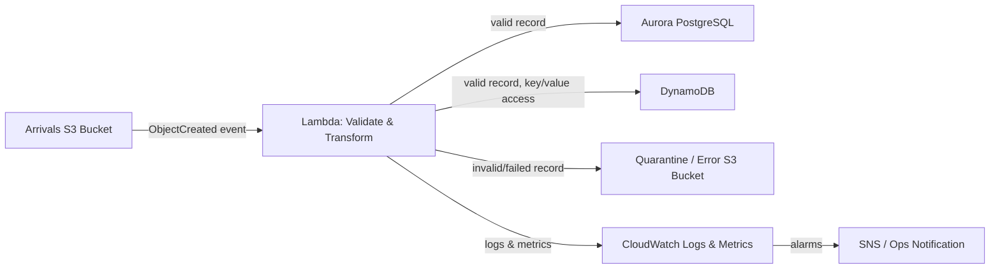

# Next-Stage Design: File Ingestion Pipeline

## Overview

This document describes a possible next-stage design for processing inbound
files on AWS, using an event-driven, serverless pipeline.



## Components

### 1. Arrivals bucket (S3)

* Agreed inbound location where upstream systems drop files.
* An S3 event notification (`s3:ObjectCreated:*`) triggers the processing
  Lambda directly, so processing starts as soon as a file lands — no polling.
* Lifecycle rules keep the bucket from growing unbounded:
  * Transition to `STANDARD_IA` after 30 days, `GLACIER` after 90 days.
  * Expire (delete) objects after 180 days.
  * Abort incomplete multipart uploads after 7 days.

### 2. Processing Lambda

* Triggered by the S3 `ObjectCreated` event on the arrivals bucket.
* Responsibilities:
  * Validate file structure/schema and business rules.
  * Apply lightweight transformation (parsing, normalization, enrichment).
  * Route each record to the appropriate store (see below).
  * On any validation/processing failure, copy the offending object (or
    record) to the quarantine bucket with error metadata, then continue
    processing the rest of the file rather than failing the whole batch.
* Idempotent: safe to re-invoke on the same S3 key (e.g. on retry) without
  double-writing records — use a natural key / upsert semantics.

### 3. Data stores

* **Aurora PostgreSQL** — default target for structured, relational data
  that needs joins, transactions, or ad-hoc querying.
* **DynamoDB** — used only where access is a pure key/value lookup pattern
  (e.g. high-throughput point lookups), to take advantage of predictable
  low-latency performance and on-demand scaling.

### 4. Quarantine / error bucket

* Receives files or records that fail validation or transformation.
* Object key includes the original key plus a reason/error code, so failures
  are traceable back to source.
* Same style of lifecycle policy as the arrivals bucket (e.g. expire after
  90 days) so quarantined data doesn't accumulate indefinitely, while still
  giving operators a window to investigate.

### 5. Observability (CloudWatch)

* Lambda emits structured logs (one JSON line per record/file outcome) to
  CloudWatch Logs.
* Custom metrics: `FilesProcessed`, `RecordsValid`, `RecordsQuarantined`,
  `ProcessingErrors`, `ProcessingDurationMs`.
* CloudWatch Alarms on error rate / Lambda failures, notifying an SNS topic
  for operational visibility.

## Example: S3 lifecycle configuration (arrivals bucket)

```json
{
  "Rules": [
    {
      "ID": "arrivals-retention",
      "Status": "Enabled",
      "Filter": {},
      "Transitions": [
        { "Days": 30, "StorageClass": "STANDARD_IA" },
        { "Days": 90, "StorageClass": "GLACIER" }
      ],
      "Expiration": { "Days": 180 },
      "AbortIncompleteMultipartUpload": { "DaysAfterInitiation": 7 }
    }
  ]
}
```

## Example: S3 event notification triggering the Lambda

```json
{
  "LambdaFunctionConfigurations": [
    {
      "LambdaFunctionArn": "arn:aws:lambda:REGION:ACCOUNT_ID:function:process-arrivals",
      "Events": ["s3:ObjectCreated:*"]
    }
  ]
}
```

The Lambda's resource policy must grant `s3.amazonaws.com` `lambda:InvokeFunction`
permission, scoped with `SourceArn` set to the arrivals bucket ARN.

## Failure handling notes

* Configure the Lambda's event source with a low `MaximumRetryAttempts`
  and a Dead Letter Queue (SQS) for invocations that fail outright (as
  opposed to record-level validation failures, which are handled inline by
  writing to the quarantine bucket).
* Keep quarantine writes and CloudWatch metric emission best-effort but
  logged, so a downstream failure there doesn't crash the whole invocation.
